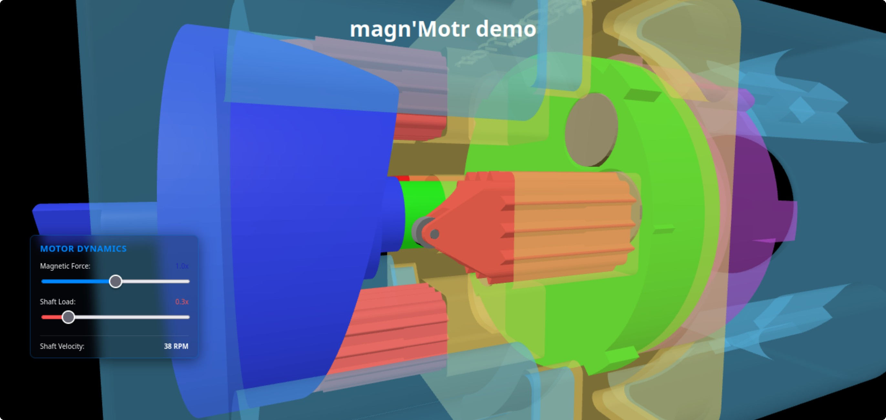

# magn'Motr Drive System

<p align="center">
  
</p>

<p align="center">
  <a href="https://coetz3r.github.io/portfolio" target="_blank"><strong>🚀 Live Interactive Demo</strong></a>
</p>

[](https://github.com/coetz3r/magn-Motr)

**Repository:** https://github.com/coetz3r/magn-Motr

---

## Overview

**magn'Motr** is an open-source, interactive 3D mechanical demonstration and maker project showcasing magnetic motor dynamics and dynamic swashplate kinematics.

Designed as a zero-build, plug-and-play WebGL application, it renders high-precision mechanical motion natively in the browser using Three.js ES Modules. The project pairs a real-time, full-screen interactive simulation with complete CAD models and 3D-printable STL files for hardware fabrication.

---

### Key Highlights

* **Interactive Physics & Controls:** Adjust magnetic force and shaft load dynamically to visualize velocity and torque response in real time.
* **Automated Housing Transparency:** Outer structural casings render with semi-transparent physical materials so internal pistons and linkages remain visible during operation.
* **Maker-Ready Assets:** Includes physical CAD source files and 3D-printable STL meshes alongside the web simulation engine.
* **Zero-Build Architecture:** Runs natively using standard ES Modules—no `npm`, bundlers, or compilation required.

---

## 🛠️ Project Structure & Maker Assets

This repository contains both the web-based WebGL simulation engine and the physical design files needed to build or adapt the mechanical assembly:

* **`/cad`**: Native parametric CAD models and step files.
* **`/stl`**: 3D-printable mesh files ready for slicing.
* **`/js`**: Interactive Three.js engine and dynamic load calculation scripts.
* **`/assets`**: Compressed `.glb` runtime assets and design graphics.

---

## ✨ Features

- **Real-Time Kinematics Simulation**: Interactive swashplate-to-piston displacement powered by custom JS physics loops.
- **Dynamic Controls Overlay**: Adjust magnetic force and shaft load parameters on the fly to see real-time RPM/velocity feedback.
- **Automated Shell Transparency**: Outer casings render semi-transparently so internal mechanical linkages remain visible during operation.
- **Full-Screen Responsive Viewport**: High-DPI canvas auto-resizes to fit any display without build setup or framework overhead.
- **Zero-Build Architecture**: Runs natively using ES Modules and Import Maps—no `npm`, bundlers, or toolchains required.

---

## Interactive Controls

| Input / Gesture | Action |
| :--- | :--- |
| **Left Click + Drag** | Orbit / rotate camera around the model center |
| **Right Click + Drag** | Pan camera position across the viewport plane |
| **Ctrl + Right Click + Drag** | Fine-tuned vertical and lateral camera adjustment |
| **Scroll Wheel** | Zoom camera in / out relative to focal target |

---

## Live View & Local Server Setup

Because modern web browsers restrict loading external 3D assets (`.glb`) and ES Modules over `file://` protocols, the project must be served over a local HTTP connection to view it.

---

### 1. Terminal (Python Server)
Open your terminal inside the project root folder and run:

```bash
python3 -m http.server 8000
```
Then navigate to `http://localhost:8000` in your web browser.

---

## Repository Structure

```text
assets/
├── magn-Motr.glb                         # WebGL 3D model asset
├── magn-Motr.png                         # Header logo
└── screenshot.jpg                        # Viewport showcase screenshot

cad/
└── magna'motr protOtipe 31jul2026.FCStd  # FreeCAD source project file

css/
└── style.css                             # Viewport & canvas layout styles

docs/                                     # Project documentation assets

js/
└── magn-Motr.js                          # Core Three.js engine & physics logic

stl/                                      # 3D-printable manufacturing meshes
├── cam-disk.stl
├── carrier-frame.stl
├── carrier.stl
├── output-frame.stl
├── piston-block.stl
├── piston.stl
├── rotor.stl
└── wheel.stl

index.html                                # Web entry point & ES import map
license.md                                # Open source license text
readme.md                                 # Repository documentation
```
---

## License

Copyright © 2026 Pieter Coetzer

Distributed under the **MIT License**. Free for personal, academic, and commercial usage. See `LICENSE` for details.